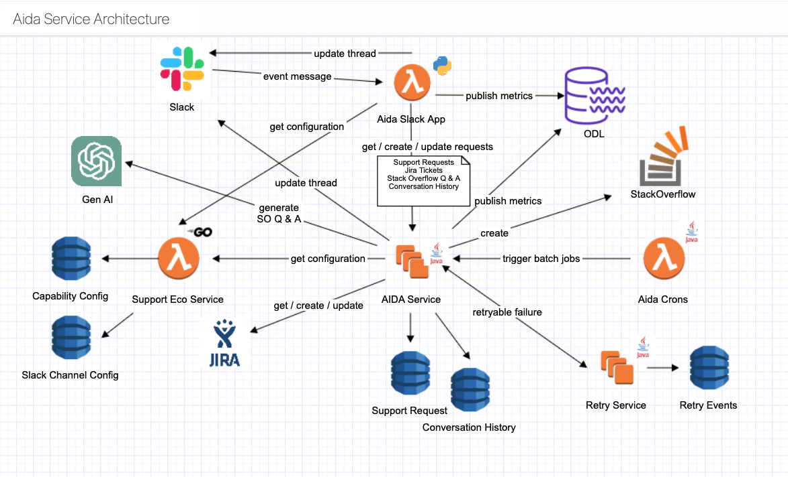
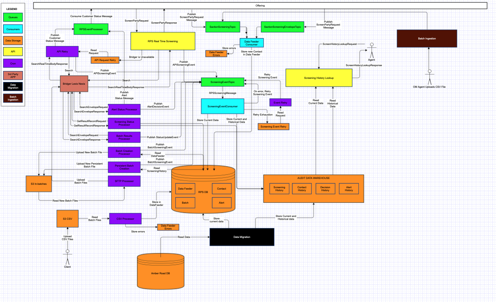
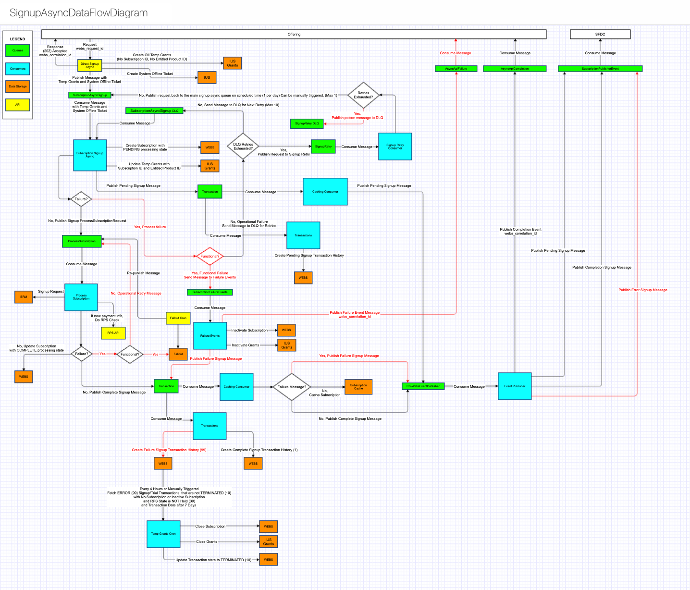
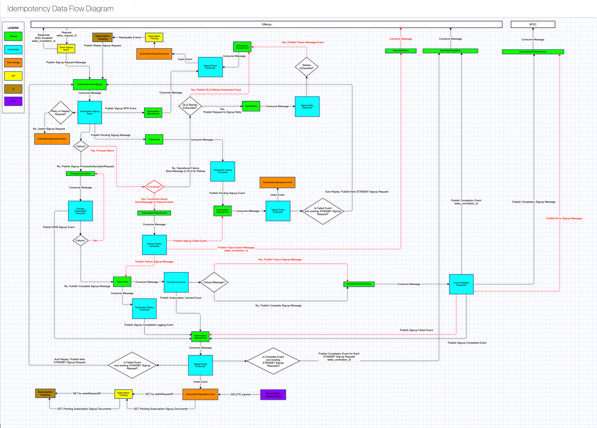

# Carlos Mariscal — Project Case Studies

---

## 1. AI Support Assistant (AIDA) — Intuit

**Role:** Staff Software Engineer, Developer Success Team (2023–2025)

### Problem

Intuit's internal developer support operated across hundreds of Slack channels with high message volume. Support engineers were overwhelmed by repetitive questions, lacked visibility into support trends, and had no automated way to triage or respond to common inquiries. Knowledge was scattered across Slack history, wikis, Autura docs, GitHub markup, and StackOverflow.

### Architecture & Approach

Designed and built a multi-service AI support assistant integrating:

- **Slack App (AWS Lambda + Go):** Receives Slack event messages, routes them through the AIDA pipeline, and updates threads with AI-generated responses.
- **AIDA Service (Java, Spring Boot, Kubernetes):** Core orchestration service that handles support requests, manages conversation history, creates/updates Jira tickets, triggers batch jobs, and publishes metrics. Integrates with Gen AI (OpenAI) and Glean RAG for retrieval-augmented generation across indexed knowledge sources.
- **Support Eco Service (Go, Lambda):** Generates StackOverflow-style Q&A content from support interactions and manages Slack channel configurations.
- **Insights Data Pipeline (Python, Lambda, SQS, DynamoDB):** Post-processes support threads using clustering models to identify actionable insights — documentation gaps, doc enhancements, new tool/feature opportunities, and training recommendations. Each insight type runs through a specifically designed prompt pipeline.
- **Metrics Dashboard (Java, Spring Boot, DynamoDB):** Tracks escalation rates, bot response accuracy, and support volumes for data-driven operational improvements.
- **Retry Architecture:** Dedicated retry service and retry events queue for handling transient failures with automatic retries.

### Technologies

Python, Java, Spring Boot, Go, AWS Lambda, DynamoDB, SQS, Kubernetes, ArgoCD, GraphQL, REST, OpenAI API, Glean RAG, Slack API, Jira API, Prompt Engineering, Cursor

### Outcomes

- Deployed to **220+ support channels** across Intuit
- Handled **85% of support message traffic** automatically
- Reduced support volume by **27%** on average
- Enabled data-driven insights pipeline that identified documentation gaps, enhancement opportunities, and training needs
- Provided metrics dashboard for continuous improvement of support operations

---

## 2. Sanctions Screening Platform Migration — Intuit

**Role:** Staff Software Engineer, Technical Lead (2021–2023)

### Problem

Intuit needed to migrate its sanctions screening service from Amber Road to LexisNexis (Bridger) to meet evolving regulatory compliance requirements — particularly after acquiring Credit Karma (130M+ users) and Mailchimp (14M+ users). The existing platform lacked reporting, batch screening, and audit capabilities needed for enterprise-scale compliance.

### Architecture & Approach

Led the end-to-end architecture, design, and implementation of an event-driven sanctions screening platform:

- **Real-Time Screening API (RPS):** Receives `ScreenPartyRequest` from product offerings, calls Bridger/LexisNexis for real-time screening, publishes results to `ScreeningEventTopic` via Kafka, and stores data in the RPS database.
- **Batch Processing Pipeline:** Multi-stage batch system with Batch Creation Processor, Persistent Batch Creation, and SFTP Processor for uploading batch files to S3. Batch Results Processor consumes completed screening results.
- **Kafka Event Architecture:** Multiple Kafka topics (`SanctionScreeningTopic`, `SanctionScreeningEnvelopeTopic`, `ScreeningEventTopic`) with dedicated consumers for different processing stages — Data Feeder Consumer, ScreeningEventConsumer, RPSEventProcessor, Alert Status Processor, and Screening Status Processor.
- **Data Migration:** Built migration path from Amber Road database to the new RPS database, preserving historical screening data.
- **Audit Data Warehouse:** Stores Screening History, Contact History, Decision History, and Alert History for regulatory compliance and audit trail.
- **Resilience:** API Request Retry mechanism for Bridger unavailability, Screening Event Retry with exhaustion handling, and comprehensive error storage in Data Feeder Errors.
- **CSV Ingestion:** Client-facing CSV upload capability for OM Agent batch screenings via S3.

### Technologies

Java, Spring Boot, REST, Kafka, AWS (EC2, RDS, S3, OpenSearch), Kubernetes, ArgoCD, SFTP, LexisNexis/Bridger API

### Outcomes

- Enabled compliant screening of **130M+ Credit Karma users**, **14M+ Mailchimp users**, and the entire TurboTax/QuickBooks customer base
- Delivered reporting, batch screening, and audit capabilities that did not exist in the legacy platform
- Supported Intuit's post-acquisition compliance objectives across all product teams
- Built resilient architecture with retry mechanisms, error handling, and data migration from legacy systems

---

## 3. AI Performance Review Assistant — Zoox

**Role:** Senior Application Engineer (October 2025 – Present)

### Problem

Zoox's biannual performance review process for 2,800+ employees required extensive manual effort from managers — collecting feedback, analyzing performance data, and writing structured reviews. The process consumed thousands of manager hours and lacked consistency across the organization.

### Architecture & Approach

Led the design and delivery of an AI-powered performance review pipeline:

- **Automated Feedback Collection:** System collects and aggregates performance data, peer feedback, and self-assessments for each employee.
- **AI-Powered Analysis:** Uses LLM-based processing to generate structured review artifacts from collected data, ensuring consistency and completeness.
- **Parallelism & Batching:** Cut end-to-end runtime substantially by introducing parallel processing and intelligent batching to eliminate sequential bottlenecks.
- **Intelligent Caching:** Reduced AI API costs by 60–80% through caching strategies that avoid redundant LLM calls for similar inputs.
- **Access Control:** Automated role-based access control for generated review artifacts, ensuring compliance with HR data sensitivity requirements.
- **Stakeholder Alignment:** Partnered closely with HR, managers, and leadership to align the tool with business needs, compliance requirements, and review workflows.

### Technologies

Python, OpenAI API, Prompt Engineering, Cursor (Claude Sonnet)

### Outcomes

- Generated **26,000+ structured review artifacts** for **2,800+ employees**
- Saved approximately **1,400 manager hours** per biannual review cycle
- Reduced AI costs by **60–80%** through intelligent caching
- Accelerated delivery timeline using AI-assisted development (Cursor + Claude Sonnet)

---

## 4. Subscription Signup Idempotency — Intuit

**Role:** Staff Software Engineer, Technical Lead (2019–2021)

### Problem

Intuit's Online Billing Platform suffered from critical production bugs caused by duplicate subscription signup requests. Concurrent requests could create multiple subscriptions in the database, inactivate customer grants when a second request failed, publish failure events with incorrect correlation IDs, and leave poison messages unprocessed. These defects directly impacted QuickBooks Online subscription success rates and required significant L1/L2 support intervention.

### Architecture & Approach

Designed a comprehensive event-driven idempotency solution with an 18-page detailed design document:

- **Idempotency Check (DocumentDB):** On receiving a signup request, the Signup Consumer upserts a `SubscriptionSignupDocument` keyed by `webs_request_id`. The returned sequence number determines whether this is a new request (sequence = 1), a retry of a failed request, or a duplicate of a processing/completed request.
- **7+ Async Consumers:** Each microservice in the signup flow publishes typed events (`SignupEventDTO`) to a `SubscriptionSignupEvent` queue:
  - Signup Consumer (initial request + idempotency check)
  - Process Subscription Consumer (BRM integration)
  - Subscription Caching Consumer
  - Event Publisher Consumer (completion/failure events to QBO)
  - Failure Event Consumer
  - Transaction History Consumer
  - Signup Retry Consumer (DLQ exhaustion handling)
- **Event Sourcing for Debugging:** Every event in the signup lifecycle is recorded in the `SubscriptionSignupDocument`, creating a complete audit trail for each signup request.
- **Automatic Replay:** When a request fails and a STANDBY duplicate exists, the system automatically replays the next queued request.
- **Tracking UI & API:** Built a front-end (App Fabric) and API (MSAAS) that allows PDs, L1/L2 Support, and BSAs to view signup request events and replay failed transactions.
- **Poison Message Handling:** Dedicated retry consumer with configurable exhaustion thresholds. Exhausted messages are surfaced in the tracking UI for manual intervention.
- **Data Lifecycle:** Cron job purges completed documents after 3 days, failed after 7 days, and all documents after 30 days.

### Technologies

Java, Spring Boot, Redis, AWS (Aurora, DocumentDB), ActiveMQ, Jenkins, SQL, Docker, Kubernetes, ArgoCD

### Outcomes

- Eliminated duplicate subscription creation bugs that directly impacted customer experience
- Provided real-time visibility into signup request lifecycle with event tracking UI
- Enabled automated replay of failed transactions, reducing L1/L2 support intervention
- Created a replayable event architecture that could surface and recover from poison messages
- Mentored team of 5 engineers (Gorillaz team) in design patterns and distributed systems concepts

---

## 5. Private Catalog Offers Refactoring — Intuit

**Role:** Senior Software Engineer, Technical Lead (2017–2019)

### Problem

The Private Catalog Offers API was a monolithic 1,381-line service class (`OfferServiceImpl`) with severe performance and maintainability issues. VisualVM profiling revealed that database transitions were called 1,236 times taking 53.9 seconds for a single Salesforce-type query. AddOn lookups triggered hundreds of additional database calls. Production worst-case response time was 43,485ms. Unit tests took 20 minutes to run.

### Architecture & Approach

Led a complete refactoring using SOLID principles and the Strategy design pattern:

- **Strategy Pattern for Query Actions:** Replaced monolithic conditional logic with dedicated strategy classes — `GetEligibleOfferForAdditionQueryActionStrategy`, `GetEligibleOfferForMigrationQueryActionStrategy`, `GetEligibleOfferForChangeQueryActionStrategy`, `GetEligibleOfferForSwitchQueryActionStrategy`.
- **Catalog Model Library:** Extracted domain models into a separate library (`webs-pri-catalog-model-library`) for reuse across services.
- **Redis/CouchBase Caching Layer:**
  - AddOn criteria cached to eliminate repeated database calls with identical criteria.
  - Query criteria cached in CouchBase with scheduled refresh (every 12 hours).
  - Cache preloaded on startup for common AddOn criteria.
  - Quartz-scheduled cache refresh jobs (AddOns every 2 hours, queries every 12 hours).
  - Async endpoint for on-demand cache refresh.
- **Concurrent Processing:** Parallelized `getTransitions` and `getExtendedAttributes` database calls instead of sequential execution.
- **Early Pagination:** Moved pagination before processing (max 500 results) instead of after, dramatically reducing the data processed per request.
- **Single Database Call for Transitions:** Replaced 1,236 individual database calls with a single batched query.

### Technologies

Java, Spring Boot, Redis, CouchBase, AWS, Jenkins, Git, JPA, REST, Amazon Aurora, Quartz Scheduler, VisualVM

### Outcomes

- Achieved up to **60% performance gains** through concurrent processing and algorithm optimization
- **90% faster response times** for cache hits via Redis-based caching
- Reduced database calls from 1,236 to 1 for transitions lookup
- Improved code maintainability by decomposing monolith into Strategy-pattern classes with clear separation of concerns
- Migrated from Mule to Spring Boot microservices and transitioned from on-premise to AWS
